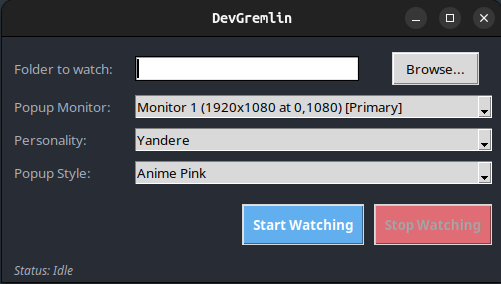

# DevGremlin

**DevGremlin** is a Python desktop app that watches your code files in real-time and gives you humorous, personality-driven comments on your code — powered by GPT4All.

---

<p align="center">
  
</p>

---

## Features

- Monitors your chosen folder for changes in code files
- Supports many programming languages (Python, JavaScript, Java, C, and more)
- Multiple AI personalities to customize your feedback style
- Stylish popup notifications with customizable themes

---

## Installation

1. **Clone the repository:**
   ```bash
   git clone https://github.com/BidAhs/DevGremlin.git
   cd DevGremlin
   ```

2. **Install dependencies:**
   ```bash
   pip install watchdog gpt4all
   ```

3. **Download a GPT4All model:**
   - Visit [GPT4All models](https://gpt4all.io/index.html) and download a `.gguf` model file (e.g., `mistral-7b-instruct-v0.1.Q4_0.gguf`).
   - Place the model file in `gpt4all/models/` within the project directory.

---

## Requirements

- Python 3.8+
- Windows, macOS, or Linux
- Tkinter (usually included with Python)
- [GPT4All](https://gpt4all.io/) model file in `gpt4all/models/`

---

## Usage

1. Run the app:
   ```bash
   python3 devGremlin.py
   ```
2. Select the folder you want to watch.
3. Pick a personality and popup style.
4. Click **Start Watching**.

---

## Personalities

Choose your feedback style from these personalities:

- **DevGPT (sarcastic senior dev):** Dry humor and clever critiques.
- **Cheerful Intern:** Positive and encouraging.
- **Concerned Parent:** Gentle concern and advice.
- **Gremlin Mischief:** Playful and mischievous.
- **SimplifyMaster (overconfident dev):** Always suggests rewriting everything.

---

## Popup Styles

Customize your notification look:

- **Classic Terminal:** Retro green-on-black terminal vibes.
- **Light Mode:** Clean, modern, and bright.
- **Dark Mode:** Sleek and easy on the eyes.

---

## How It Works

- Watches your selected folder for code changes using `watchdog`.
- When a file changes, grabs the last 50 lines and sends it to GPT4All with your chosen personality prompt.
- Displays a popup with the AI's comment using Tkinter.

---

## Troubleshooting

- **Missing model file:** Download a `.gguf` model and place it in `gpt4all/models/`.
- **Tkinter errors:** Ensure Python was installed with Tkinter support.
- **No popups:** Check your OS's window manager or popup blocker settings.
- **Permission errors:** Run the app with appropriate permissions to access the folder you want to watch.

---

## Contributions & Issues

Contributions and issues are welcome! Feel free to open pull requests or report bugs.

---

## License

MIT License

---

## Acknowledgments

- [GPT4All](https://gpt4all.io/) for powering the AI feedback  
- [Watchdog](https://pypi.org/project/watchdog/) for folder monitoring  
- [Tkinter](https://docs.python.org/3/library/tkinter.html) for UI

---

